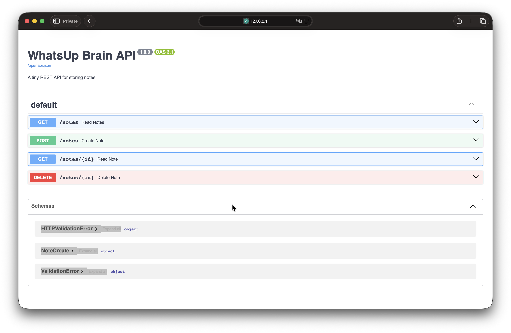

# WhatsUp-Brain

A tiny REST API built to learn backend development from scratch.

The goal of this project wasn't to build another notes app. It was to understand how the different layers of a backend work together, from receiving an HTTP request to storing data inside a database.

## What it does

- Create a brain dump (note).

- Retrieve all stored notes.

- Retrieve a single note by its ID.

- Delete a note.

- Persist data locally using SQLite.

<p align="center">
  
</p>

## Tech Stack

| Technology | Why I used it                                                           |
| :--------- | :---------------------------------------------------------------------- |
| Python     | Main programming language.                                              |
| FastAPI    | Build the REST API.                                                     |
| Uvicorn    | Run the FastAPI application locally.                                    |
| Pydantic   | Validate incoming request data.                                         |
| SQLAlchemy | Interact with the database using Python objects instead of writing SQL. |
| SQLite     | Lightweight relational database for local development.                  |

## Architecture

```text
Client
   │
HTTP Request
   │
Uvicorn
   │
FastAPI
   │
Pydantic
   │
Application Logic
   │
SQLAlchemy
   │
SQLite
   │
HTTP Response
   │
Client
```

## Project Structure

```text
app/
├── database.py
├── main.py
├── models.py
└── schemas.py
docs/
└── project.md
```

## Getting Started

Clone the repository.

```bash
git clone https://github.com/hashfailo/WhatsUp-Brain
cd WhatsUp-Brain
```

Create a virtual environment.

```bash
python3 -m venv .venv
```

Activate it.

macOS / Linux

```bash
source .venv/bin/activate
```

Install the dependencies.

```bash
pip install -r requirements.txt
```

Run the application.

```bash
uvicorn app.main:app --reload
```

Open your browser.

```text
http://127.0.0.1:8000/docs
```

Swagger UI lets you test the API directly from your browser.

## API Endpoints

### Create a note

```text
POST /notes
```

Example request:

```json
{
  "content": "just whateverrr"
}
```

Example response:

```json
{
  "id": 1,
  "note": "just whateverrr"
}
```

---

### Retrieve all notes

```text
GET /notes
```

Example response:

```json
[
  {
    "id": 1,
    "note": "just whateverrr"
  }
]
```

---

### Retrieve a specific note

```text
GET /notes/1
```

Example response:

```json
{
  "id": 1,
  "note": "did it workkk?"
}
```

---

### Delete a specific note

```text
DELETE /notes/1
```

Example response:

```json
{
  "message": "Note deleted successfully."
}
```

---

## What I learned

This project helped me understand:

- How a backend receives and processes HTTP requests.

- How FastAPI maps routes to Python functions.

- How request validation works using Pydantic.

- How SQLAlchemy translates Python objects into SQL.

- How SQLite stores data in relational tables.

- How all the backend layers communicate with each other.

- A complete Git workflow for building and publishing a project.

---

Built to understand backend development by building a tiny REST API.
